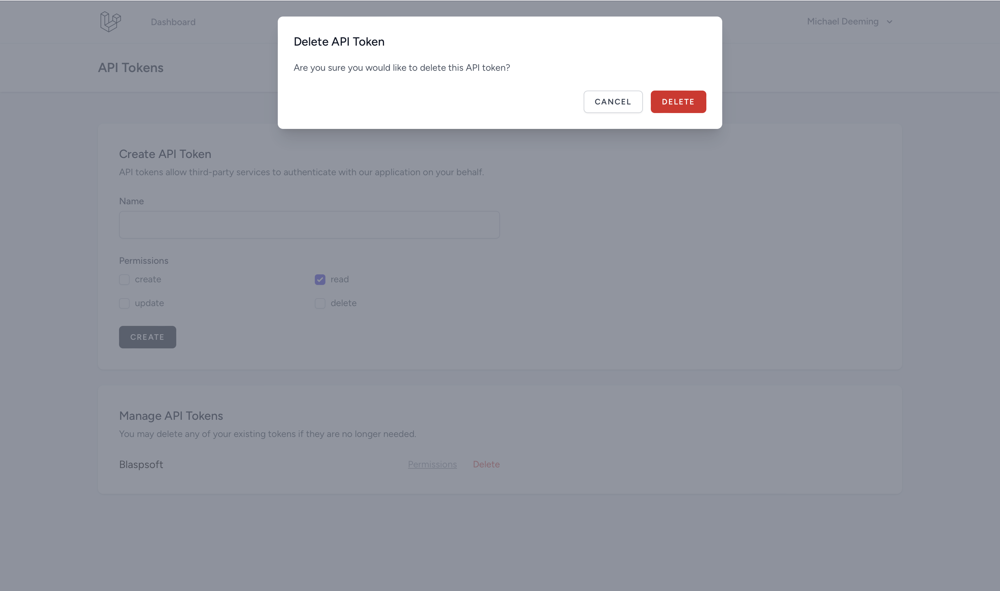

<p align="center">
    
    <p align="center">
        <a href="https://packagist.org/packages/blaspsoft/token-forge"></a>
        <a href="https://packagist.org/packages/blaspsoft/token-forge"></a>
        <a href="https://packagist.org/packages/blaspsoft/token-forge"></a>
    </p>
</p>

# Token Forge - API Token Management for Laravel Breeze

`blaspsoft/token-forge` is a Laravel package that adds robust, customizable API token management to your application, inspired by Laravel Jetstream. Token Forge allows you to create, manage, and monitor API tokens with ease, providing secure access control for your API.

**Note:** This package currently only supports applications using **Laravel Breeze with the Inertia Vue stack**.

## Features

- Generate and manage API tokens for users
- Define token permissions for precise access control
- Monitor token activity and revoke tokens when necessary
- Seamlessly integrates with Laravel’s authentication and session management

## Requirements

This package requires the following dependencies:

- **Laravel Breeze**: Specifically the Inertia Vue stack for front-end support.
- **Laravel Sanctum**: Provides token-based authentication for API tokens.

Make sure these dependencies are installed and configured:

```bash
composer require laravel/breeze --dev
php artisan breeze:install vue
composer require laravel/sanctum
php artisan install:api
php artisan migrate
npm install
npm run dev
```

## Installation

Install the package via Composer:

```bash
composer require blaspsoft/token-forge
```

After installing the package, publish the configuration file:

```bash
php artisan vendor:publish --tag=token-forge-config --force
```

This command will publish a configuration file at `config/token-forge.php`, where you can customize Token Forge settings.

## Setup Instructions

### 1. Sanctum Setup

Ensure that Laravel Sanctum is properly configured. Make sure the `HasApiTokens` trait is added to your `User` model:

```php
use Laravel\Sanctum\HasApiTokens;

class User extends Authenticatable
{
    use HasApiTokens, Notifiable;
}
```

Additionally, ensure that Sanctum's setup command is run to install its configuration and migrations:

```bash
php artisan install:api
php artisan migrate
```

This will publish Sanctum's configuration and migration files, and running `php artisan migrate` ensures the necessary database tables are created.

### 2. Middleware Configuration

To ensure that Token Forge integrates smoothly with your Inertia responses, modify your `HandleInertiaRequest.php` middleware file as follows:

Add the following block to the `share` method in `app/Http/Middleware/HandleInertiaRequest.php`:

```php
public function share(Request $request): array
{
    return [
        ...parent::share($request),
        'auth' => [
            'user' => $request->user(),
        ],
        'flash' => [
            'tokenForge' => [
                'token' => fn () => session()->get('token'),
            ],
        ],
    ];
}
```

This setup enables Token Forge to flash token information to your Inertia responses, allowing you to use the token in your Vue components.

### 3. API Token Management Routes

Once the package is installed and configured, you can manage API tokens using the following routes:

| Method | URI                   | Controller Action            | Description                  |
| ------ | --------------------- | ---------------------------- | ---------------------------- |
| GET    | `/api-tokens`         | `ApiTokenController@index`   | Display the API tokens list  |
| POST   | `/api-tokens`         | `ApiTokenController@store`   | Create a new API token       |
| PUT    | `/api-tokens/{token}` | `ApiTokenController@update`  | Update an existing API token |
| DELETE | `/api-tokens/{token}` | `ApiTokenController@destroy` | Delete an API token          |

These routes provide a complete interface to generate, view, and revoke API tokens through a consistent REST API.

## Configuration

The package configuration is located in `config/token-forge.php`. Here are the default values:

### Default Permissions

```php
'default_permissions' => [
    'read',
],
```

These are the default permissions assigned to new API tokens if no specific permissions are provided during creation.

### Available Permissions

```php
'available_permissions' => [
    'create',
    'read',
    'update',
    'delete',
],
```

These are the permissions available to assign to API tokens. You can modify these values to fit your application’s needs.

If you wish to change the default or available permissions, publish the configuration file using:

```bash
php artisan vendor:publish --tag=token-forge-config --force
```

Then, update the `config/token-forge.php` file to reflect your desired permissions.

## Final Step: Build Assets

After completing the setup, ensure your front-end assets are compiled. You can use one of the following commands:

- For development:

  ```bash
  npm run dev
  ```

- For production:

  ```bash
  npm run build
  ```

This will ensure the necessary assets are available for the API token management UI.

## Screenshots

<div align="center">
    
    
    
    
    
</div>

## License

This package is open-source software licensed under the [MIT license](LICENSE.md).
